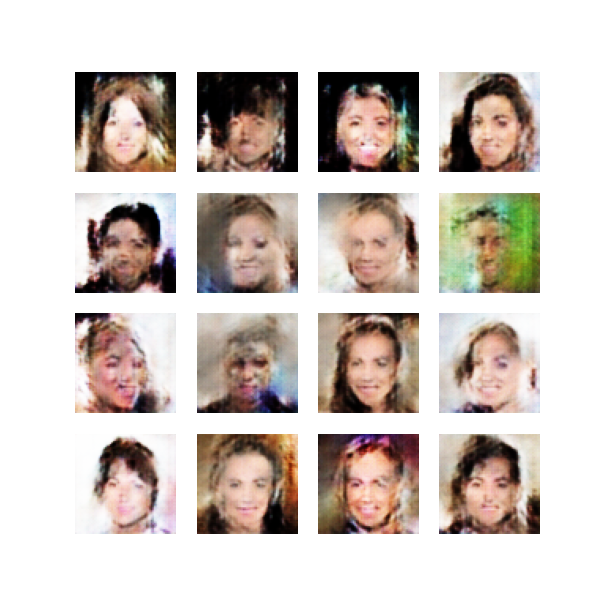
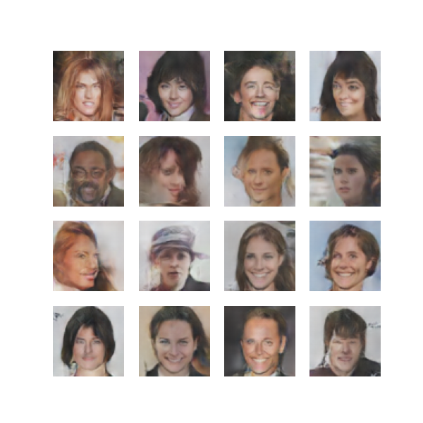
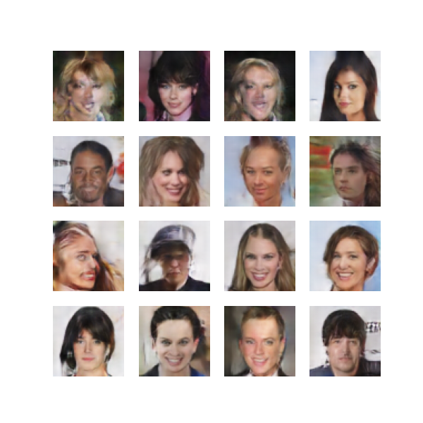

# Génération d'Images de Visages humain avec DCGAN

##  Description du Projet

Ce projet implémente un **DCGAN (Deep Convolutional GAN)** pour générer des images réalistes de visages humains. Le modèle a été entraîné sur le dataset **CelebA** et utilise une architecture basée sur des **couches convolutionnelles transposées** pour le générateur et des **convolutions** pour le discriminateur.

## 🛠 Technologies Utilisées

- **Python 3.8+**
- **PyTorch** (`torch`, `torchvision`)
- **NumPy**
- **Matplotlib**
- **Pillow**
- **Kaggle API** (pour télécharger le dataset CelebA)

##  Structure du Projet

```
│── data/                      # Contient les images du dataset CelebA
│── generated_images/          # Stocke les images générées par le modèle
│── dataset.py                 # Classe CustomDataset pour charger les images
│── model.py                   # Définition des modèles du générateur et du discriminateur
│── train.py                   # Script principal d'entraînement du DCGAN
│── utils.py                   # Téléchargement et extraction des données
│── requirements.txt            # Liste des dépendances Python
│── README.md                   # Documentation du projet
```

##  Installation

### 1 Cloner le dépôt

```bash
git clone <URL_DU_REPO>
cd <NOM_DU_REPO>
```

### 2 Installer les dépendances

```bash
pip install -r requirements.txt
```

### 3 Télécharger le dataset CelebA (depuis Kaggle)

- Ajouter votre clé API Kaggle (`kaggle.json`) dans `~/.kaggle/`
- Exécuter :

```bash
python utils.py
```

##  Entraînement du Modèle

Lancer l'entraînement avec :

```bash
python train.py
```

###  Hyperparamètres par défaut :

- **Époques** : 50
- **Batch size** : 128
- **Taille du vecteur latent** : 100
- **Optimiseur** : Adam (`lr=0.0002, betas=(0.5, 0.999)`)

Le modèle génère et enregistre des images à chaque époque dans **`generated_images/`**.

##  Architecture du Modèle

###  Générateur (Generator)
- Convertit un vecteur aléatoire (**z_dim=100**) en une image **RGB 64x64**.
- Utilise des **couches convolutionnelles transposées** avec `BatchNorm` et `ReLU`.

###  Discriminateur (Discriminator)
- Reçoit une image et prédit si elle est **réelle ou générée**.
- Utilise des **couches convolutionnelles** avec `LeakyReLU` et `BatchNorm`.

## Résultats Attendus

### Évolution des images générées au fil du temos

| Epoch 1 | Epoch 25 | Epoch 50 |
|---------|---------|---------|
|  |  |  |

**Analyse des résultats** :
- **Epoch 1** : Les images sont très bruitées et non reconnaissables.
- **Epoch 25** : Apparition de formes humaines, mais encore floues.
- **Epoch 50** : Visages plus nets et réalistes.


##  Améliorations Possibles

- **Augmenter la résolution** (128x128 ou 256x256) pour des visages plus nets.
- **Expérimenter avec WGAN-GP** pour stabiliser l'entraînement.
- **Optimiser l’architecture** en ajoutant plus de couches ou en utilisant d'autres techniques d’augmentation.


